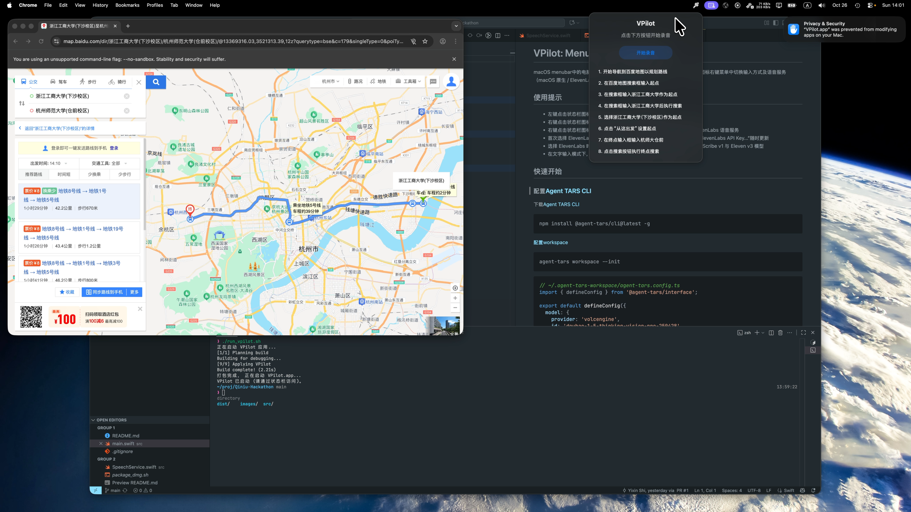

# VPilot: Menubar中的语音Agent

macOS menubar中的电脑操作Agent助手，支持语音与文本输入，可在状态栏图标右键菜单中切换输入方式及语音服务（macOS 原生 / ElevenLabs），基于[Agent TARS CLI](https://github.com/bytedance/UI-TARS-desktop)

## 演示视频

[](https://vimeo.com/1130605715)

## 使用提示

- 左键点击状态栏图标唤出输入窗口，默认启用语音输入
- 右键点击状态栏图标，在“输入方式”菜单中选择“语音输入”或“文字输入”
- 右键点击状态栏图标，在“语音服务”菜单中切换使用 macOS 原生或 ElevenLabs 语音服务
- 首次选择 ElevenLabs 会弹窗输入 API Key，可在同一菜单中通过“配置 ElevenLabs API Key...”随时更新
- 选择 ElevenLabs 时，语音识别与语音播报都会改为调用 ElevenLabs 的 Scribe v1 与 Eleven v3 模型
- 在文字输入模式下，可直接键入指令并按回车或点击“发送指令”按钮

## 分工

- [施一信](https://github.com/Shi1xin)：原型开发，User Flow设计，技术选型
- [汪瑾](https://github.com/JeanMuyx)：功能开发（文字输入、语音选项），文档撰写

## 快速开始

### 配置[Agent TARS CLI](https://github.com/bytedance/UI-TARS-desktop)

下载[Agent TARS CLI](https://github.com/bytedance/UI-TARS-desktop)

```shell
npm install @agent-tars/cli@latest -g
```

[配置workspace](https://agent-tars.com/guide/basic/workspace)

```shell
agent-tars workspace --init
```

```typescript
// ~/.agent-tars-workspace/agent-tars.config.ts
import { defineConfig } from '@agent-tars/interface';

export default defineConfig({
  model: {
    provider: 'volcengine',
    id: 'doubao-1-5-thinking-vision-pro-250428',
    "apiKey": "YOUR-API-KEY"  
  }
});
```

## 安装VPilot软件

前往 [Releases](https://github.com/Shi1xin/Qiniu-Hackathon/releases) 下载 VPilot.dmg，打开后将应用拖入 `Applications` 后即可分发或安装。

## 调试与开发

```shell
gh repo clone Shi1xin/Qiniu-Hackathon
```

```shell
./Qiniu-Hackathon/run_voicebar.sh
```

## 编译为dmg

```shell
./package_dmg.sh
```