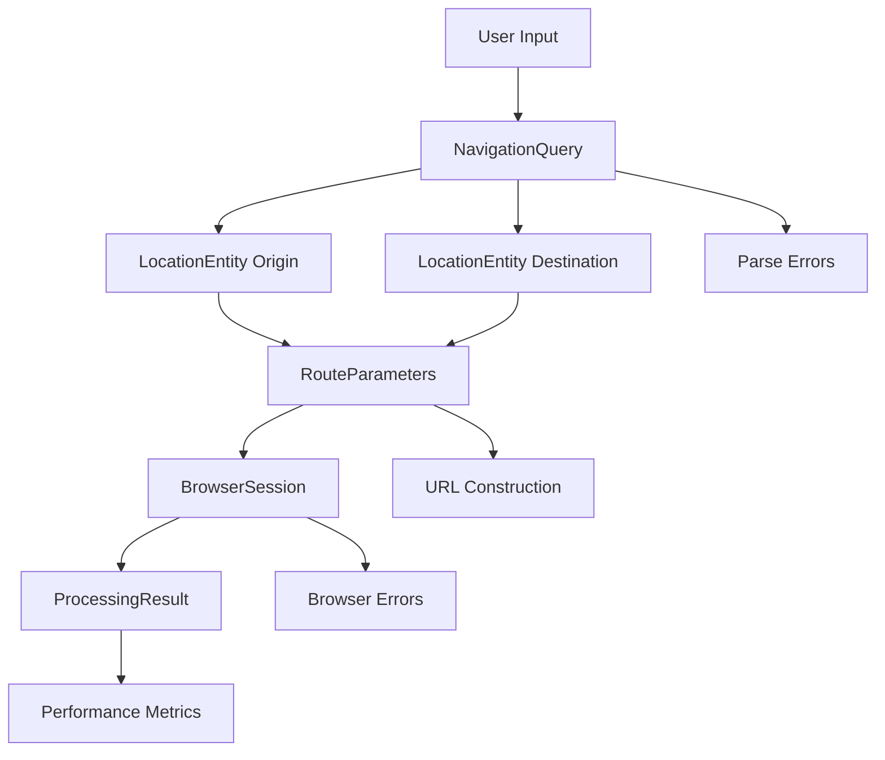

# Data Model: CLI Navigation Tool

**Version**: 1.0
**Created**: 2025-01-24
**Based on**: Feature Specification and Research Findings

## Core Entities

### 1. NavigationQuery

Represents the user's natural language input containing origin and destination information.

```python
from pydantic import BaseModel, Field, validator
from typing import Optional, List, Dict, Any
from enum import Enum

class QueryType(str, Enum):
    CITY_TO_CITY = "city_to_city"           # 从北京到上海
    DISTRICT_TO_DISTRICT = "district_to_district"  # 从中关村到三里屯
    LANDMARK_TO_LANDMARK = "landmark_to_landmark"  # 天安门到故宫
    TRANSPORT_TO_TRANSPORT = "transport_to_transport"  # 北京站到首都机场
    UNIVERSITY_TO_UNIVERSITY = "university_to_university"  # 清华大学到北京大学
    UNKNOWN = "unknown"

class NavigationQuery(BaseModel):
    """Represents a user's navigation query in natural language"""

    # Core fields
    raw_input: str = Field(..., description="Original user input text")
    origin: Optional[str] = Field(None, description="Parsed origin location")
    destination: Optional[str] = Field(None, description="Parsed destination location")
    query_type: QueryType = Field(QueryType.UNKNOWN, description="Type of navigation query")

    # Processing metadata
    confidence_score: float = Field(0.0, ge=0.0, le=1.0, description="Confidence in parsing accuracy")
    parsing_method: str = Field("unknown", description="Method used for parsing (regex, nlp, llm)")
    processing_time_ms: int = Field(0, ge=0, description="Time taken to parse in milliseconds")

    # Error handling
    parse_errors: List[str] = Field(default_factory=list, description="Errors encountered during parsing")
    needs_clarification: bool = Field(False, description="Whether user input needs clarification")

    @validator('origin', 'destination')
    def validate_locations(cls, v):
        if v is not None:
            v = v.strip()
            if len(v) < 1:
                raise ValueError("Location cannot be empty")
        return v

    @validator('raw_input')
    def validate_input_length(cls, v):
        if len(v.strip()) < 3:
            raise ValueError("Input too short to be a valid navigation query")
        if len(v) > 200:
            raise ValueError("Input too long for processing")
        return v.strip()

    def is_valid(self) -> bool:
        """Check if query has valid origin and destination"""
        return self.origin is not None and self.destination is not None

    def to_dict(self) -> Dict[str, Any]:
        """Convert to dictionary for serialization"""
        return {
            "raw_input": self.raw_input,
            "origin": self.origin,
            "destination": self.destination,
            "query_type": self.query_type.value,
            "confidence_score": self.confidence_score,
            "parsing_method": self.parsing_method,
            "processing_time_ms": self.processing_time_ms,
            "parse_errors": self.parse_errors,
            "needs_clarification": self.needs_clarification
        }
```

### 2. LocationEntity

Represents parsed location information with confidence scoring.

```python
class LocationType(str, Enum):
    CITY = "city"           # 市: 北京, 上海
    DISTRICT = "district"   # 区: 海淀区, 朝阳区
    LANDMARK = "landmark"   # 地标: 天安门, 故宫
    TRANSPORT = "transport" # 交通: 站, 机场, 港
    UNIVERSITY = "university" # 大学: 清华大学
    ADDRESS = "address"     # 地址: 具体街道地址
    UNKNOWN = "unknown"

class LocationEntity(BaseModel):
    """Represents a parsed location with metadata"""

    # Core location data
    name: str = Field(..., description="Location name")
    type: LocationType = Field(LocationType.UNKNOWN, description="Type of location")
    confidence: float = Field(0.0, ge=0.0, le=1.0, description="Confidence score 0-1")

    # Context and disambiguation
    context: Optional[str] = Field(None, description="Additional context for disambiguation")
    alternatives: List[str] = Field(default_factory=list, description="Alternative location names")
    parent_region: Optional[str] = Field(None, description="Parent administrative region")

    # Processing metadata
    extraction_method: str = Field("unknown", description="Method used for extraction")
    coordinates: Optional[Dict[str, float]] = Field(None, description="GPS coordinates if available")

    @validator('name')
    def validate_name(cls, v):
        if not v or len(v.strip()) < 1:
            raise ValueError("Location name cannot be empty")
        return v.strip()

    @validator('confidence')
    def validate_confidence(cls, v):
        if v < 0.5:
            raise ValueError("Location confidence too low for reliable navigation")
        return v

    def is_high_confidence(self) -> bool:
        """Check if location has high confidence"""
        return self.confidence >= 0.8

    def needs_disambiguation(self) -> bool:
        """Check if location needs user clarification"""
        return self.confidence < 0.7 or len(self.alternatives) > 1
```

### 3. RouteParameters

Structured data containing origin and destination for URL construction.

```python
class TransportMode(str, Enum):
    DRIVING = "car"
    WALKING = "walk"
    TRANSIT = "bus"
    RIDING = "ride"
    TRUCK = "truck"

class RouteParameters(BaseModel):
    """Structured route parameters for URL construction"""

    # Route endpoints
    origin: LocationEntity = Field(..., description="Starting location")
    destination: LocationEntity = Field(..., description="Destination location")

    # Route preferences
    transport_mode: TransportMode = Field(TransportMode.DRIVING, description="Preferred transport mode")
    avoid_tolls: bool = Field(False, description="Avoid toll roads")
    avoid_highways: bool = Field(False, description="Avoid highways")

    # URL construction
    service_provider: str = Field("gaode", description="Mapping service provider")
    encoded_origin: Optional[str] = Field(None, description="URL-encoded origin")
    encoded_destination: Optional[str] = Field(None, description="URL-encoded destination")

    # Processing
    construction_time_ms: int = Field(0, ge=0, description="Time to construct URLs in ms")

    @validator('service_provider')
    def validate_provider(cls, v):
        allowed_providers = ["gaode", "baidu", "tencent"]
        if v not in allowed_providers:
            raise ValueError(f"Service provider must be one of: {allowed_providers}")
        return v

    def get_navigation_url(self) -> str:
        """Construct complete navigation URL"""
        if self.service_provider == "gaode":
            return self._construct_gaode_url()
        else:
            raise ValueError(f"URL construction not implemented for {self.service_provider}")

    def _construct_gaode_url(self) -> str:
        """Construct Gaode Maps navigation URL"""
        from urllib.parse import quote, urlencode

        base_url = "https://uri.amap.com/navigation"
        params = {
            'from': self.encoded_origin or quote(self.origin.name),
            'to': self.encoded_destination or quote(self.destination.name),
            'mode': self.transport_mode.value,
            'coordinate': 'gaode',
            'callnative': '0'
        }

        if self.avoid_tolls:
            params['toll'] = '0'
        if self.avoid_highways:
            params['highway'] = '0'

        return f"{base_url}?{urlencode(params)}"
```

### 4. BrowserSession

Represents a browser session for navigation.

```python
class BrowserType(str, Enum):
    CHROMIUM = "chromium"
    FIREFOX = "firefox"
    WEBKIT = "webkit"

class BrowserSession(BaseModel):
    """Represents a browser session state"""

    # Browser configuration
    browser_type: BrowserType = Field(BrowserType.CHROMIUM)
    headless: bool = Field(False, description="Run browser in headless mode")
    user_agent: Optional[str] = Field(None, description="Custom user agent string")

    # Session state
    session_id: str = Field(..., description="Unique session identifier")
    launched_at: Optional[str] = Field(None, description="Launch timestamp")
    page_url: Optional[str] = Field(None, description="Current page URL")

    # Performance metrics
    launch_time_ms: int = Field(0, ge=0, description="Browser launch time in ms")
    navigation_time_ms: int = Field(0, ge=0, description="Page navigation time in ms")

    # Error handling
    launch_errors: List[str] = Field(default_factory=list, description="Errors during launch")
    navigation_errors: List[str] = Field(default_factory=list, description="Errors during navigation")

    def is_active(self) -> bool:
        """Check if browser session is active"""
        return self.session_id is not None and self.page_url is not None

    def get_total_time_ms(self) -> int:
        """Get total session time"""
        return self.launch_time_ms + self.navigation_time_ms
```

### 5. ProcessingResult

Overall result of processing a navigation query.

```python
class ResultStatus(str, Enum):
    SUCCESS = "success"
    PARSE_ERROR = "parse_error"
    BROWSER_ERROR = "browser_error"
    NETWORK_ERROR = "network_error"
    TIMEOUT_ERROR = "timeout_error"
    USER_ERROR = "user_error"
    SYSTEM_ERROR = "system_error"

class ProcessingResult(BaseModel):
    """Complete result of processing a navigation query"""

    # Result status
    status: ResultStatus = Field(..., description="Overall processing status")
    success: bool = Field(..., description="Whether processing was successful")
    message: str = Field(..., description="Human-readable result message")

    # Processing chain
    query: Optional[NavigationQuery] = Field(None, description="Parsed navigation query")
    route_params: Optional[RouteParameters] = Field(None, description="Route parameters")
    browser_session: Optional[BrowserSession] = Field(None, description="Browser session info")

    # Performance metrics
    total_time_ms: int = Field(0, ge=0, description="Total processing time in ms")
    component_times: Dict[str, int] = Field(default_factory=dict, description="Component processing times")

    # Error details
    error_type: Optional[str] = Field(None, description="Type of error if failed")
    error_details: Optional[Dict[str, Any]] = Field(None, description="Detailed error information")

    # User guidance
    suggestions: List[str] = Field(default_factory=list, description="Suggestions for user")
    help_text: Optional[str] = Field(None, description="Additional help text")

    @validator('total_time_ms')
    def validate_performance(cls, v):
        if v > 5000:  # 5 seconds
            raise ValueError("Processing time exceeds 5 second limit")
        return v

    def meets_performance_target(self) -> bool:
        """Check if result meets 3-second performance target"""
        return self.total_time_ms <= 3000

    def get_user_message(self) -> str:
        """Get user-friendly message"""
        if self.success:
            if self.total_time_ms < 1000:
                return f"✅ 路线规划成功！耗时 {self.total_time_ms}ms"
            elif self.total_time_ms < 3000:
                return f"✅ 路线规划完成，耗时 {self.total_time_ms}ms"
            else:
                return f"⚠️ 路线规划完成，但耗时较长 ({self.total_time_ms}ms)"
        else:
            return f"❌ {self.message}"
```

## Data Relationships

### Processing Flow



### State Transitions

1. **Input → Query**: Natural language parsing with confidence scoring
2. **Query → Route**: Structured parameter construction for URL building
3. **Route → Browser**: Browser launch and navigation with error handling
4. **Browser → Result**: Success/failure determination with performance metrics

## Validation Rules

### Input Validation
- Minimum 3 characters for meaningful location queries
- Maximum 200 characters to prevent processing abuse
- Must contain origin and destination indicators

### Location Validation
- Confidence score >= 0.5 for reliable navigation
- Name length 1-100 characters
- Type must be in supported location categories

### Performance Validation
- Total processing time <= 5 seconds (hard limit)
- Target processing time <= 3 seconds (success criteria)
- Browser launch time <= 1 second (performance target)

### Error Validation
- All error paths must have user-friendly messages
- Suggestions must be provided for common errors
- System details should not be exposed to users

## Data Persistence Strategy

### No Database Required
This CLI tool is stateless and doesn't require persistent storage. All data exists in memory during processing.

### Optional Caching
- Location parsing results (TTL: 1 hour)
- Browser session pooling (TTL: 5 minutes)
- Common query patterns (TTL: 24 hours)

### Export/Import
- Results can be exported as JSON for debugging
- Configuration files use YAML format
- Logs use structured JSON format

## Security Considerations

### Input Sanitization
- Strip HTML/JavaScript from user input
- Validate URL parameters before construction
- Limit input length to prevent DoS

### Data Privacy
- No user data stored permanently
- No analytics or tracking
- Local processing only (no cloud storage)

### Error Information
- Sanitize error messages to prevent information disclosure
- Log technical details separately from user messages
- Provide generic error messages for security-sensitive failures