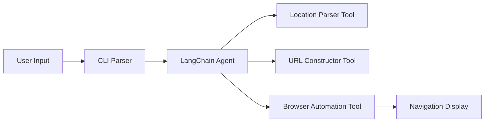

# Quick Start Guide: CLI Navigation Tool

**Purpose**: Get the CLI Navigation Tool running in under 10 minutes
**Target**: Developers working on the implementation
**Prerequisites**: Python 3.11+, Git, Modern web browser

## Installation & Setup

### 1. Clone and Setup Environment

```bash
# Clone the repository
git clone <repository-url>
cd Qiniu-Hackathon

# Create virtual environment
python3.11 -m venv venv
source venv/bin/activate  # On Windows: venv\Scripts\activate

# Install dependencies
pip install -r requirements.txt
```

### 2. Install Playwright Browsers

```bash
# Install browser binaries
playwright install chromium

# Verify installation
playwright install --dry-run
```

### 3. Configure Environment

```bash
# Copy environment template
cp .env.example .env

# Edit environment variables
nano .env
```

**Required .env variables:**
```bash
# LLM Configuration
OPENAI_API_KEY=your_openai_api_key_here
# OR
ANTHROPIC_API_KEY=your_anthropic_api_key_here

# Optional: Performance settings
DEFAULT_BROWSER=chromium
HEADLESS_MODE=false
TIMEOUT_MS=5000
```

## Basic Usage

### 1. Simple Navigation Query

```bash
# Basic usage
python -m nav_cli "从北京到上海"

# With specific browser
python -m nav_cli "中关村到三里屯" --browser chromium

# Headless mode (for automation)
python -m nav_cli "天安门到故宫" --headless
```

### 2. Expected Output

```bash
$ python -m nav_cli "从北京到上海"
✅ 正在解析位置信息...
✅ 构建导航URL...
✅ 启动浏览器...
✅ 路线规划成功！耗时 2450ms

浏览器已打开，显示北京到上海的导航路线。
按 Enter 键关闭浏览器...
```

### 3. Help and Options

```bash
# Show help
python -m nav_cli --help

# Available options
python -m nav_cli "从A到B" \
  --browser chromium \
  --headless \
  --timeout 3000 \
  --service gaode
```

## Development Workflow

### 1. Running Tests

```bash
# Run all tests
pytest

# Run specific test categories
pytest tests/unit/test_parsing.py
pytest tests/integration/test_browser.py
pytest tests/contract/test_api.py

# Run with coverage
pytest --cov=nav_cli --cov-report=html
```

### 2. Development Mode

```bash
# Install in development mode
pip install -e .

# Run with debug output
python -m nav_cli "从北京到上海" --debug

# Check performance
python -m nav_cli "从北京到上海" --profile
```

### 3. Code Quality

```bash
# Format code
black nav_cli/
isort nav_cli/

# Type checking
mypy nav_cli/

# Linting
flake8 nav_cli/
```

## Architecture Overview

### High-Level Flow



### Key Components

1. **CLI Interface** (`nav_cli/cli.py`)
   - Typer-based command-line interface
   - Input validation and error handling
   - Progress reporting to user

2. **Agent System** (`nav_cli/agent.py`)
   - LangChain ReAct agent orchestration
   - Tool selection and execution
   - Error recovery and retry logic

3. **Location Parser** (`nav_cli/parsers/`)
   - Chinese NLP with PaddleNLP + Jieba
   - Pattern matching for common formats
   - Confidence scoring and disambiguation

4. **Browser Automation** (`nav_cli/browser/`)
   - Playwright-based browser control
   - Cross-platform compatibility
   - Connection pooling for performance

5. **URL Construction** (`nav_cli/urls/`)
   - Gaode Maps URL building
   - Parameter encoding and validation
   - Alternative URL generation

## Testing Your Changes

### 1. Unit Testing

```python
# Test location parsing
pytest tests/unit/test_location_parser.py -v

# Test URL construction
pytest tests/unit/test_url_constructor.py -v

# Test browser automation
pytest tests/unit/test_browser_launcher.py -v
```

### 2. Integration Testing

```bash
# Test end-to-end flow
pytest tests/integration/test_navigation_flow.py -v

# Test performance requirements
pytest tests/integration/test_performance.py -v
```

### 3. Manual Testing

```bash
# Test common query patterns
python -m nav_cli "从北京到上海"          # City to city
python -m nav_cli "中关村到三里屯"        # District to district
python -m nav_cli "天安门到故宫"          # Landmark to landmark
python -m nav_cli "北京站到首都机场"       # Transport to transport

# Test error handling
python -m nav_cli ""                      # Empty input
python -m nav_cli "无效输入"               # Invalid input
python -m nav_cli "从火星到木星"           # Impossible locations
```

## Performance Monitoring

### 1. Performance Targets

- **Total Response Time**: <3 seconds (95th percentile)
- **Agent Processing**: <1.5 seconds
- **Browser Launch**: <0.5 seconds
- **Cache Hit Rate**: >60% for common queries

### 2. Performance Profiling

```bash
# Enable performance profiling
python -m nav_cli "从北京到上海" --profile

# View performance report
cat /tmp/nav_cli_profile.json | python -m json.tool
```

### 3. Benchmarking

```bash
# Run performance benchmarks
python -m nav_cli.benchmark --queries benchmark_queries.txt

# Sample benchmark queries
echo "从北京到上海
中关村到三里屯
天安门到故宫
北京站到首都机场
清华大学到北京大学" > benchmark_queries.txt
```

## Troubleshooting

### Common Issues

#### 1. Browser Launch Fails

```bash
# Symptoms: "Browser launch timed out" error
# Solutions:
playwright install chromium  # Reinstall browsers
python -m nav_cli --help    # Check system requirements

# Check browser permissions (macOS)
xattr -rd com.apple.quarantine $(which chromium)
```

#### 2. LLM API Errors

```bash
# Symptoms: "API key invalid" or "Rate limit exceeded"
# Solutions:
# Check .env file
cat .env | grep API_KEY

# Test API connection
python -c "from nav_cli.llm import test_connection; test_connection()"
```

#### 3. Chinese Text Parsing Issues

```bash
# Symptoms: "Cannot parse location information"
# Solutions:
# Test with known good queries
python -m nav_cli "从北京到上海"

# Check NLP dependencies
pip list | grep -E "(paddle|jieba)"
```

### Debug Mode

```bash
# Enable debug output
python -m nav_cli "从北京到上海" --debug

# Check logs
tail -f /tmp/nav_cli.log

# Verbose agent execution
DEBUG=1 python -m nav_cli "从北京到上海"
```

## Contributing

### 1. Code Style

- Use Black for code formatting
- Follow PEP 8 guidelines
- Type hints required for all public functions
- Docstrings for all modules and functions

### 2. Testing Requirements

- All new features must include unit tests
- Integration tests for end-to-end flows
- Performance tests for critical paths
- Maintain >90% test coverage

### 3. Submitting Changes

```bash
# Create feature branch
git checkout -b feature/new-feature

# Make changes and test
pytest
black .
isort .

# Commit and push
git add .
git commit -m "feat: add new feature"
git push origin feature/new-feature
```

## Next Steps

1. **Explore the codebase**: Start with `nav_cli/cli.py` and `nav_cli/agent.py`
2. **Run the examples**: Try different query formats and options
3. **Run the test suite**: Ensure all tests pass in your environment
4. **Make a small change**: Add a new query pattern or error message
5. **Read the full specification**: See `spec.md` for complete requirements

## Resources

- [Feature Specification](spec.md) - Complete requirements and user stories
- [Data Model](data-model.md) - Entity definitions and relationships
- [API Contracts](contracts/cli-api.yaml) - Internal API documentation
- [Research Findings](research.md) - Technical research and decisions
- [Architecture Overview](../README.md) - High-level system design

## Getting Help

- Check the troubleshooting section above
- Review existing GitHub issues
- Check the debug logs in `/tmp/nav_cli.log`
- Run `python -m nav_cli --help` for available options
- Contact the development team for specific issues